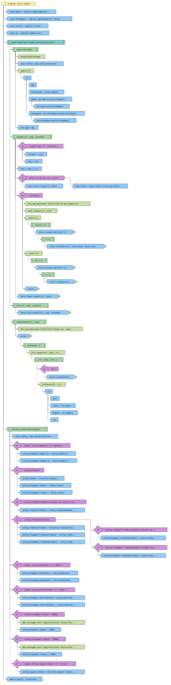
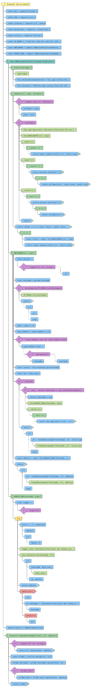
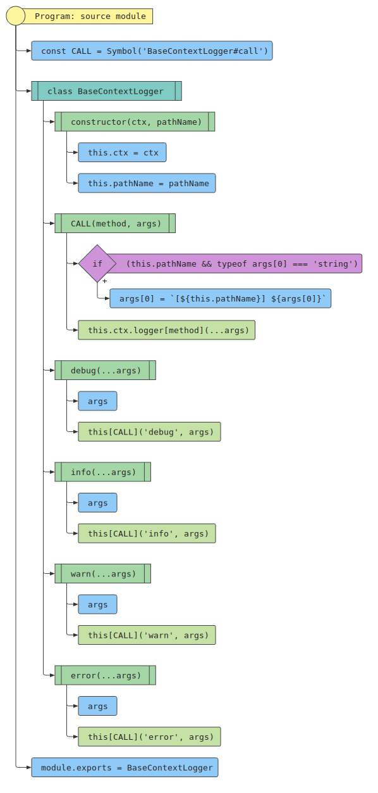
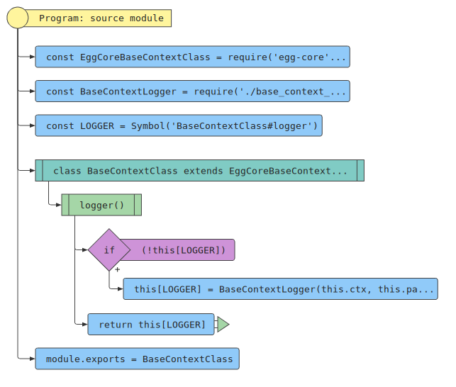
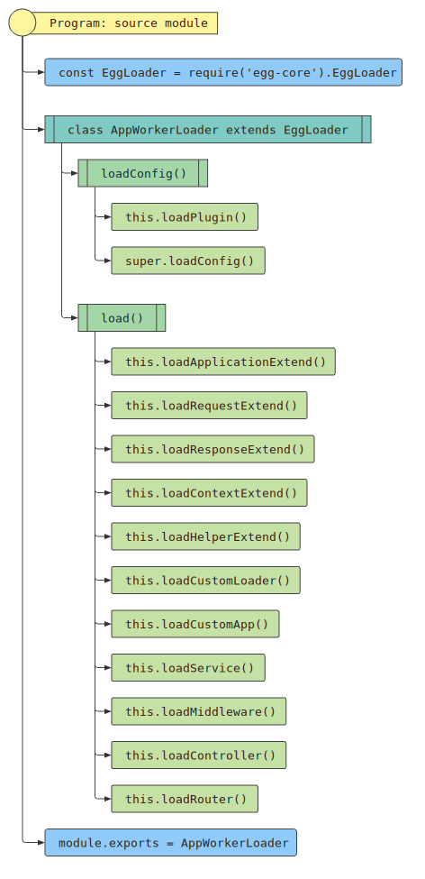
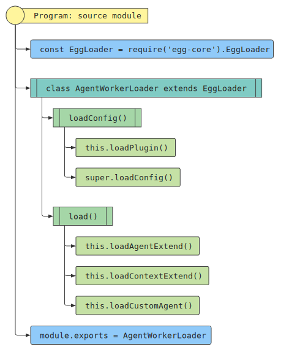
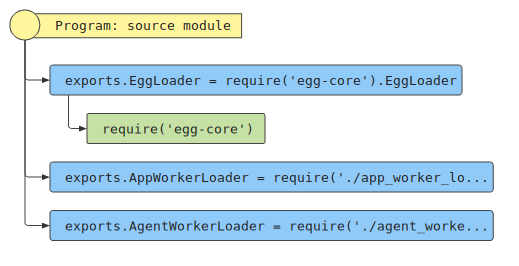
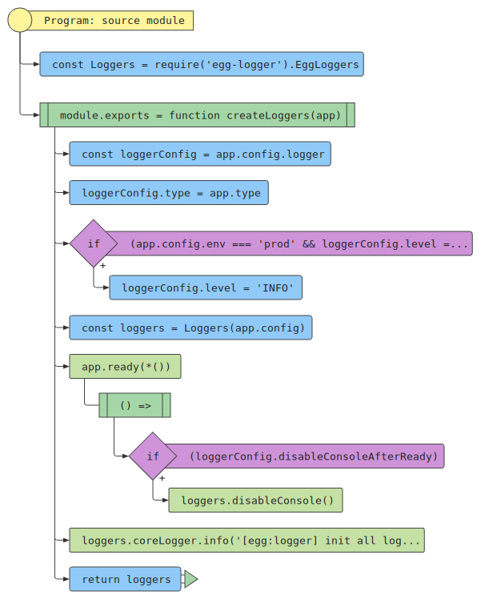
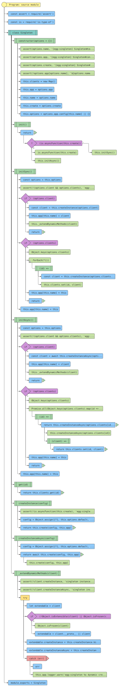

# 源码分析

## 文件结构

``` bash
├── agent.js
├── app
|  ├── extend
|  |  ├── context.js
|  |  ├── helper.js
|  |  ├── request.js
|  |  └── response.js
|  └── middleware
|     ├── body_parser.js
|     ├── meta.js
|     ├── notfound.js
|     ├── override_method.js
|     └── site_file.js
├── appveyor.yml - 持续集成CI文件
├── config
|  ├── config.default.js
|  ├── config.local.js
|  ├── config.unittest.js
|  ├── favicon.png
|  └── plugin.js
├── index.d.ts - 声明文件
├── index.js - 入口文件
├── lib
|  ├── agent.js
|  ├── application.js
|  ├── core
|  |  ├── base_context_class.js - 继承自egg-core的BaseContextClass，并加上base_context_logger的实例用作logger对象的get
|  |  ├── base_context_logger.js - 封装了基础logger，底层调用ctx.logger
|  |  ├── base_hook_class.js
|  |  ├── context_httpclient.js
|  |  ├── dnscache_httpclient.js - 继承于httpclient.js，进行dns缓存请求，优化性能
|  |  ├── httpclient.js - 继承于urllib的HttpClient2，封装了request
|  |  ├── logger.js - 实例化egg-logger的EggLoggers，对外暴露实例
|  |  ├── messenger
|  |  |  ├── index.js - 单进程模型使用local.js，多进程模型使用pid。
|  |  |  ├── ipc.js - 用于给子进程进行通信，底层基于sendmessage模块，基于subprocess.send来进行通信。
|  |  |  └── local.js - 用于当前进程内部通信，基于EventEmitter封装了一个通信管理messennger
|  |  ├── singleton.js - 根据配置config，和传入的create方法，创建指定name的app，兼容同步和异步。
|  |  └── utils.js
|  ├── egg.js
|  ├── jsdoc
|  |  ├── context.jsdoc
|  |  ├── request.jsdoc
|  |  └── response.jsdoc
|  ├── loader
|  |  ├── agent_worker_loader.js - 继承自egg-core的EggLoader，逐个调用agent进程的加载函数
|  |  ├── app_worker_loader.js - 继承自egg-core的EggLoader，逐个调用加载函数
|  |  └── index.js - 将egg-core的EggLoader和app_worker_loader，agent_worker_loader的loader对外暴露
|  └── start.js - 启动文件，初始化Agent和Application，建立关系
├── scripts
|  ├── commits.sh
|  ├── deploy_key.enc
|  └── doc_travis.sh
```

## 模块依赖关系

egg.js
对外模块依赖


对内模块依赖


## 各文件解析

### index.js

入口文件，用于将内部各模块对外暴露


### lib/start.js

启动文件，初始化Agent和Application，建立关系，最后返回application。


### lib/core/messenger/local.js

用于当前进程内部通信，基于EventEmitter封装了一个通信管理messennger


### lib/core/messenger/pid.js

用于给子进程进行通信，底层基于sendmessage模块，基于[subprocess.send](https://nodejs.org/dist/latest-v10.x/docs/api/child_process.html#child_process_subprocess_send_message_sendhandle_options_callback)来进行通信。


### lib/core/messenger/index.js

单进程模型使用local.js，多进程模型使用pid。


### lib/core/httpclient.js

继承于urllib的HttpClient2，封装了request。



### lib/core/dnscache_httpclient.js

继承于httpclient.js，进行dns缓存请求，优化性能



### lib/core/base_context_logger.js

封装了基础logger，底层调用ctx.logger




### lib/core/base_context_class.js

继承自egg-core的BaseContextClass，并加上base_context_logger的实例用作logger对象的get



### lib/loader/app_worker_loader.js

继承自egg-core的EggLoader，逐个调用加载函数




### lib/loader/agent_worker_loader.js

继承自egg-core的EggLoader，逐个调用agent进程的加载函数



### lib/loader/index.js

将egg-core的EggLoader和app_worker_loader，agent_worker_loader的loader对外暴露



### lib/core/logger.js

实例化egg-logger的EggLoggers，对外暴露实例



### lib/core/singleton.js

根据配置config，和传入的create方法，创建指定name的app，兼容同步和异步。


