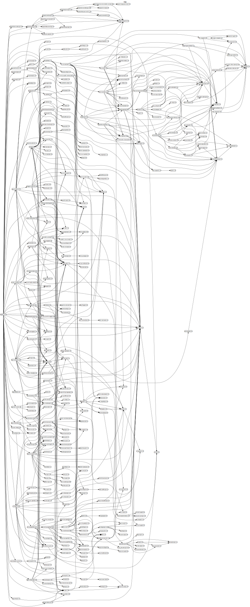
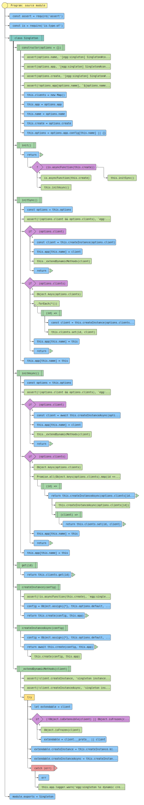
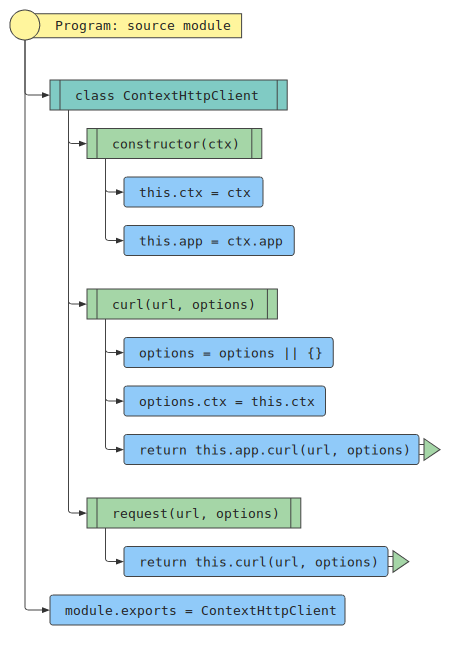
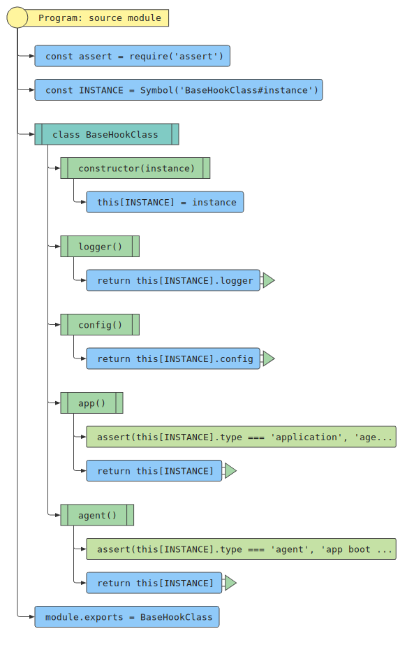
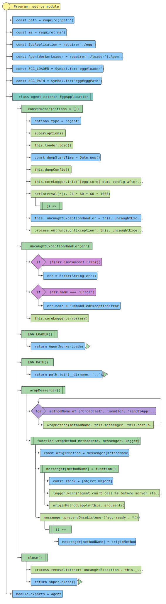
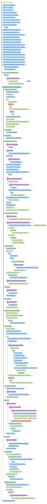
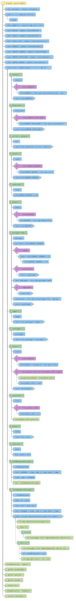
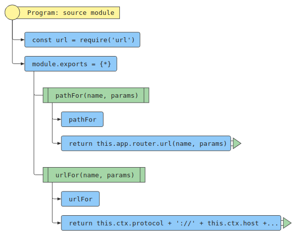
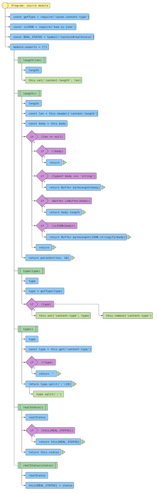

# 源码分析

## 文件结构

``` bash
├── agent.js
├── app
|  ├── extend
|  |  ├── context.js - 在loadContextExtend阶段时被加载，设置了ctx.cookies,ctx.httpclient,ctx.curl,ctx.router等等属性，并将某些request，response的属性代理到ctx上。
|  |  ├── helper.js - 在loadHelperExtend阶段时被加载。注册方法到ctx.helper上
|  |  ├── request.js - 在loadRequestExtend阶段时被加载，注册一些属性到ctx.request上。
|  |  └── response.js - 在loadResponseExtend阶段时被加载，注册一些属性到ctx.response上
|  └── middleware
|     ├── body_parser.js - 直接暴露koa-bodyparser
|     ├── meta.js - 设置头keep-alive
|     ├── notfound.js - 404中间件，重定向到pageUrl或返回默认html
|     ├── override_method.js - 直接暴露koa-override
|     └── site_file.js - favicon.icon， robots等处理
├── appveyor.yml - 持续集成CI文件
├── config
|  ├── config.default.js
|  ├── config.local.js
|  ├── config.unittest.js
|  ├── favicon.png
|  └── plugin.js - 一些内置插件，如egg-security、egg-multipart等，在egg-core的loadPlugin阶段加载
├── index.d.ts - 声明文件
├── index.js - 入口文件
├── lib
|  ├── agent.js - 继承自egg.js，并做了一些agent的处理如保证进程存活，返回agent的loader等
|  ├── application.js - 继承自egg.js，并做了一些application的处理如异常处理，书写额外配置等
|  ├── core
|  |  ├── base_context_class.js - 继承自egg-core的BaseContextClass，并加上base_context_logger的实例用作logger对象的get
|  |  ├── base_context_logger.js - 封装了基础logger，底层调用ctx.logger
|  |  ├── base_hook_class.js - 包装一层私有属性logger,cofig
|  |  ├── context_httpclient.js - 封装request，调用ctx.app.curl来请求
|  |  ├── dnscache_httpclient.js - 继承于httpclient.js，进行dns缓存请求，优化性能
|  |  ├── httpclient.js - 继承于urllib的HttpClient2，封装了request
|  |  ├── logger.js - 实例化egg-logger的EggLoggers，对外暴露实例
|  |  ├── messenger
|  |  |  ├── index.js - 单进程模型使用local.js，多进程模型使用pid。
|  |  |  ├── ipc.js - 用于给子进程进行通信，底层基于sendmessage模块，基于subprocess.send来进行通信。
|  |  |  └── local.js - 用于当前进程内部通信，基于EventEmitter封装了一个通信管理messennger
|  |  ├── singleton.js - 根据配置config，和传入的create方法，创建指定name的app，兼容同步和异步。
|  |  └── utils.js - 封装util
|  ├── egg.js - 对外暴露非常多重要的api和变量，组装context
|  ├── jsdoc
|  |  ├── context.jsdoc
|  |  ├── request.jsdoc
|  |  └── response.jsdoc
|  ├── loader
|  |  ├── agent_worker_loader.js - 继承自egg-core的EggLoader，逐个调用agent进程的加载函数
|  |  ├── app_worker_loader.js - 继承自egg-core的EggLoader，逐个调用加载函数
|  |  └── index.js - 将egg-core的EggLoader和app_worker_loader，agent_worker_loader的loader对外暴露
|  └── start.js - 启动文件，初始化Agent和Application，建立关系
├── scripts
|  ├── commits.sh
|  ├── deploy_key.enc
|  └── doc_travis.sh
```

## 模块依赖关系

egg.js
对外模块依赖



对内模块依赖


核心依赖项源码分析

- [egg-core源码分析](https://github.com/FunnyLiu/egg-core/tree/readsource) - 核心的loader和controller，service，app，等均在此封装。
- [egg-logger源码分析](https://github.com/FunnyLiu/egg-logger/tree/readsource) - 分级日志logger和transform在此封装。
- [egg-onerror源码分析](https://github.com/FunnyLiu/egg-onerror/tree/readsource) - 内置的异常处理插件，基于koa-onerror，拦截异常上报和错误页渲染模板。
- [egg-session源码分析](https://github.com/FunnyLiu/egg-session/tree/readsource) - 将koa-session作为中间件挂载，并提供了sessionStore，方便自定义存取器，供给config.session.store。
- [egg-watcher源码分析](https://github.com/FunnyLiu/egg-watcher/tree/readsource) - 底层基于ws模块负责文件监听，这里进行了配置和默认eventSource的封装。库本身是继承自sdk-base。 文件监听后对外抛出事件。


## 各文件解析

### index.js

入口文件，用于将内部各模块对外暴露


### lib/start.js

启动文件，基于agent.js和application.js初始化Agent和Application，建立关系，最后返回application。


### lib/core/messenger/local.js

用于当前进程内部通信，基于EventEmitter封装了一个通信管理messennger


### lib/core/messenger/pid.js

用于给子进程进行通信，底层基于sendmessage模块，基于[subprocess.send](https://nodejs.org/dist/latest-v10.x/docs/api/child_process.html#child_process_subprocess_send_message_sendhandle_options_callback)来进行通信。


### lib/core/messenger/index.js

单进程模型使用local.js，多进程模型使用pid。


### lib/core/httpclient.js

继承于urllib的HttpClient2，封装了request。


### lib/core/dnscache_httpclient.js

继承于httpclient.js，进行dns缓存请求，优化性能


### lib/core/base_context_logger.js

封装了基础logger，底层调用ctx.logger


### lib/core/base_context_class.js

继承自egg-core的BaseContextClass，并加上base_context_logger的实例用作logger对象的get


### lib/loader/app_worker_loader.js

继承自egg-core的EggLoader，逐个调用加载函数


### lib/loader/agent_worker_loader.js

继承自egg-core的EggLoader，逐个调用agent进程的加载函数


### lib/loader/index.js

将egg-core的EggLoader和app_worker_loader，agent_worker_loader的loader对外暴露


### lib/core/logger.js

实例化egg-logger的EggLoggers，对外暴露实例


### lib/core/singleton.js

根据配置config，和传入的create方法，创建指定name的app，兼容同步和异步。



### lib/core/context_httpclient.js

封装request，调用ctx.app.curl来请求



### lib/core/base_hook_class.js

包装一层私有属性logger,cofig




### lib/egg.js

对外暴露非常多重要的api和变量，组装context。


### lib/agent.js

继承自egg.js，并做了一些agent的处理如保证进程存活，返回agent的loader等



### lib/applicaiton.js

继承自egg.js，并做了一些application的处理如异常处理，书写额外配置等



### app/extend/context.js

在loadContextExtend阶段时被加载。
设置了ctx.cookies,ctx.httpclient,ctx.curl,ctx.router等等属性，并将某些request，response的属性代理到ctx上。




### app/extend/helper.js

在loadHelperExtend阶段时被加载。注册方法到ctx.helper上。





### app/extend/request.js

在loadRequestExtend阶段时被加载，注册一些属性到ctx.request上。


### app/extend/response.js

在loadResponseExtend阶段时被加载，注册一些属性到ctx.response上



